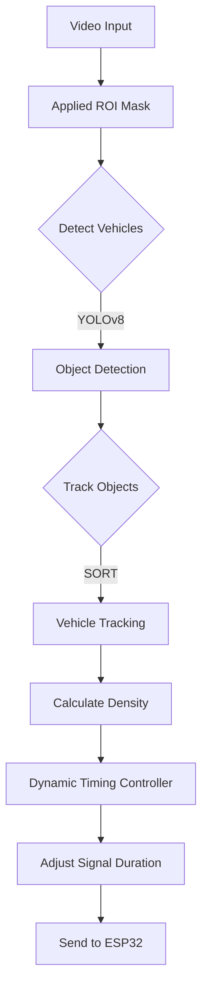

# CEP Dynamic Traffic Signal System

This project implements a dynamic traffic signal control system using YOLOv8 for vehicle detection and SORT for tracking. It adjusts traffic signal timings in real-time based on vehicle density within a specified region of interest (ROI) and communicates with an ESP32 microcontroller for signal display.

## Overview

### The Problem
Conventional traffic signals typically operate on fixed-timing plans, which do not account for real-time fluctuations in traffic volume. This often leads to inefficient green light usage, increased wait times during low-demand periods, and unnecessary congestion.

### Our Approach
We utilize computer vision techniques (OpenCV and YOLOv8) to detect and track vehicles in a defined ROI. A density-based algorithm, using a sliding window average, dynamically adjusts the remaining green phase duration. The system ensures safety by adhering to minimum and maximum green time bounds. Real-time signal status is transmitted to an ESP32 via TCP for physical LED control.

### Key Features
- **Vehicle Detection & Tracking**: Utilizes YOLOv8 and SORT strategies to identify and track vehicles.
- **Dynamic Signal Timing**: Adjusts green light duration based on a 5-second sliding average of vehicle density.
- **Safety Constraints**: Enforces green light duration to remain within a configured range (e.g., 30–90 seconds).
- **Embedded Integration**: Communicates phase status and countdowns to an ESP32 microcontroller via TCP for real-time display.

---

## Table of Contents
- [Repository Structure](#repository-structure)
- [Setup and Installation](#setup-and-installation)
- [Configuration](#configuration)
- [System Architecture](#system-architecture)
- [Hardware Integration](#hardware-integration)
- [Troubleshooting](#troubleshooting)
- [Images](#images)
- [Video](#video)
- [Future Scope](#future-scope)
- [License](#license)
- [Contributing](#contributing)
- [Contact](#contact)

---

## Repository Structure

```
CEP_Dynamic_Traffic_Signal/
├── assets/                  # Media files and model weights
│   ├── video.mp4            # Sample input video
│   ├── mask.png             # ROI mask image
│   └── yolov8l.pt           # YOLOv8 model weights
├── firmware/                # ESP32 microcontroller firmware
│   └── tcp_test_sender.py   # Utility for testing TCP communication
├── simulations/             # Additional simulation scripts
├── src/                     # Source code
│   ├── main.py              # Main application entry point
│   ├── sort.py              # SORT tracking implementation
│   └── future_scope/        # Configuration management
├── env.sample               # Environment variable template
├── requirements.txt         # Python dependencies
└── README.md                # Project documentation
```

[Back to Top](#cep-dynamic-traffic-signal-system)

---

## Setup and Installation

### Prerequisites
- Python 3.10+
- ESP32 microcontroller (optional, for hardware integration)
- Windows OS (recommended for PowerShell scripts)

### Installation Steps

1.  **Clone the Repository**
    ```bash
    git clone <repository_url>
    cd CEP_Dynamic_Traffic_Signal
    ```

2.  **Create a Virtual Environment**
    ```powershell
    python -m venv myenv
    myenv\Scripts\Activate.ps1
    ```

3.  **Install Dependencies**
    ```bash
    pip install -r requirements.txt
    ```

4.  **Environment Configuration**
    Copy the sample environment file and configure it if necessary:
    ```powershell
    copy env.sample .env
    ```
    Edit `.env` to specify your ESP32 IP address and port if they differ from the defaults.

5.  **Run the Application**
    ```powershell
    python src/main.py
    ```
    Press `q` in the application window to exit.

[Back to Top](#cep-dynamic-traffic-signal-system)

---

## Configuration

<details>
<summary><strong>Click to expand Configuration Details</strong></summary>

The system can be configured via `src/future_scope/config.json`. Key configuration options include:

-   **Video Source**: Path to the input video file.
-   **ROI Mask**: Path to the mask image defining the detection zone.
-   **Polygon Points**: Vertices coordinates for the specific Region of Interest.
-   **Communication**: Serial port settings and ESP32 TCP connection details.

Example `config.json` snippet:
```json
{
  "video_path": "assets/video.mp4",
  "esp32": {
    "ip": "10.84.30.1",
    "port": 80
  }
}
```
</details>

[Back to Top](#cep-dynamic-traffic-signal-system)

---

## System Architecture

### Processing Pipeline



### Communication Protocol
The system sends ASCII-encoded messages to the ESP32:
-   `A{seconds}`: RED phase duration.
-   `B{seconds}`: YELLOW phase duration.
-   `C{seconds}`: GREEN phase duration.

[Back to Top](#cep-dynamic-traffic-signal-system)

---

## Hardware Integration

### ESP32 Setup
1.  Connect LEDs to the ESP32 GPIO pins (ensure current limiting resistors are used).
2.  Flash the firmware located in the `firmware/` directory using the Arduino IDE or PlatformIO.
3.  Verify the ESP32 is on the same network as the host computer.

### Testing Connectivity
Use the provided utility to test TCP connectivity:
```powershell
python firmware/tcp_test_sender.py
```

[Back to Top](#cep-dynamic-traffic-signal-system)

---

## Troubleshooting

<details>
<summary><strong>Click to expand Troubleshooting Guide</strong></summary>

-   **Connection Refused**: Ensure the ESP32 IP address is correct and the device is powered on. Check firewall settings to allow outbound TCP connections.
-   **Performance Issues**: If inference is slow, switch to a lighter model (e.g., `yolov8n.pt`) or reduce the video resolution.
-   **Incorrect Detection**: Verify that `mask.png` aligns correctly with the video frame and that `polygon_points` in the configuration accurately define the traffic lanes.

</details>

<<<<<<< HEAD
- **Slow inference**: Use `yolov8n.pt` for faster processing
- **High CPU usage**: Lower video resolution or skip frames
- **ROI mismatch**: 
  - Ensure `mask.png` matches frame size (auto-resized in `main.py`)
  - Adjust `polygon_points` in `config.json` to match your actual ROI

---
## Images


---
## Video


https://github.com/user-attachments/assets/41fd3e41-b301-4d04-ba95-9b60ef2c781a


---


## Future Scope

### Planned Enhancements

- **Interactive ROI Tool**: Draw/edit the polygon on a frame and auto-save to `config.json`
- **Multiple ROIs**: Support for multiple regions of interest with per-ROI weighting
- **Configuration Formats**: Optional YAML/TOML configs with profile selection (e.g., `intersection_A.json` vs `intersection_B.json`)
- **Advanced Analytics**: Historical data logging and traffic pattern analysis
- **Multi-intersection Coordination**: Synchronize timing across multiple intersections
=======
[Back to Top](#cep-dynamic-traffic-signal-system)
>>>>>>> 56bf2a6 (cleanup project structure and remove invalid path)

---

## License
<<<<<<< HEAD

For academic/educational use only. YOLO models are subject to their respective licenses from Ultralytics.

---

## Contributing

Contributions are welcome! Please feel free to submit issues or pull requests.

---

## Contact

For questions or support, please open an issue in the repository.
=======
This project is for educational and academic purposes. YOLOv8 is subject to Ultralytics' licensing terms.
>>>>>>> 56bf2a6 (cleanup project structure and remove invalid path)
